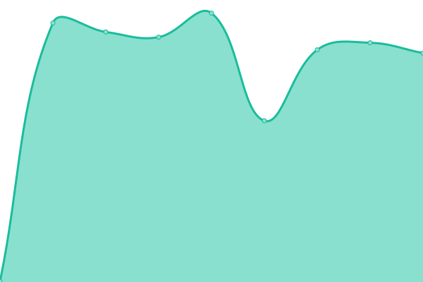
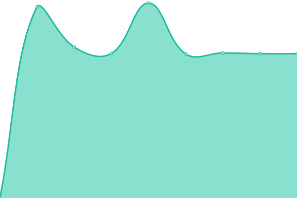
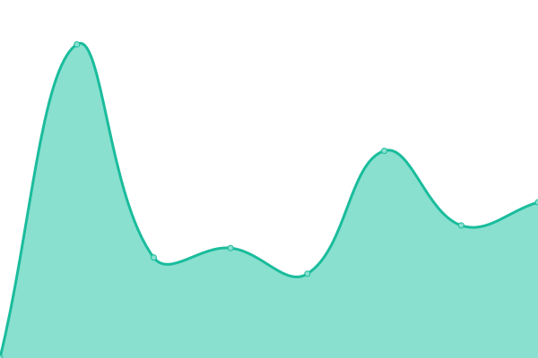
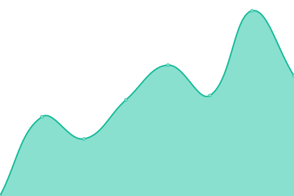
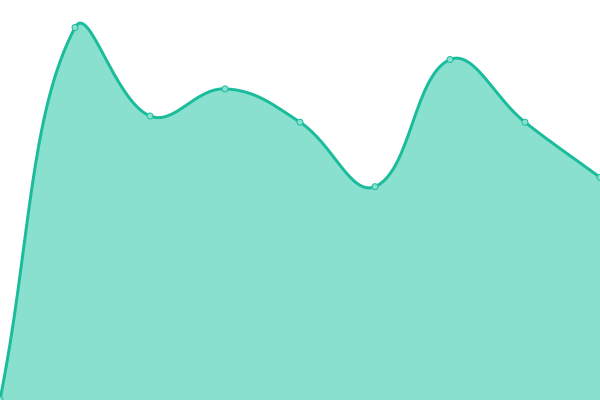

# [📈 Live Status](https://jk.github.io/upptime): <!--live status--> **🟧 Partial outage**

This repository contains the open-source uptime monitor and status page for [Jens Kohl](http://jkohl.com), powered by [Upptime](https://github.com/upptime/upptime).

With [Upptime](https://upptime.js.org), you can get your own unlimited and free uptime monitor and status page, powered entirely by a GitHub repository. We use [Issues](https://github.com/jk/upptime/issues) as incident reports, [Actions](https://github.com/jk/upptime/actions) as uptime monitors, and [Pages](https://jk.github.io/upptime) for the status page.

<!--start: status pages-->
<!-- This summary is generated by Upptime (https://github.com/upptime/upptime) -->
<!-- Do not edit this manually, your changes will be overwritten -->
<!-- prettier-ignore -->
| URL | Status | History | Response Time | Uptime |
| --- | ------ | ------- | ------------- | ------ |
|  [kohl.dev](https://kohl.dev) | 🟩 Up | [kohl-dev.yml](https://github.com/jk/upptime/commits/HEAD/history/kohl-dev.yml) | 

 475ms
     
 | 

<a href="https://jk.github.io/upptime/history/kohl-dev">100.00%</a>
    

|  [Blog](https://blog.kohl.dev) | 🟩 Up | [blog.yml](https://github.com/jk/upptime/commits/HEAD/history/blog.yml) | 

 442ms
     
 | 

<a href="https://jk.github.io/upptime/history/blog">100.00%</a>
    

|  [FreshRSS](https://freshrss.kohl.dev) | 🟩 Up | [fresh-rss.yml](https://github.com/jk/upptime/commits/HEAD/history/fresh-rss.yml) | 

 466ms
     
 | 

<a href="https://jk.github.io/upptime/history/fresh-rss">100.00%</a>
    

|  [Covid Gießen](https://covid-gi.kohl.dev) | 🟥 Down | [covid-giessen.yml](https://github.com/jk/upptime/commits/HEAD/history/covid-giessen.yml) | 

 456ms
     
 | 

<a href="https://jk.github.io/upptime/history/covid-giessen">0.00%</a>
    

|  [Nexus Artifact Registry](https://nexus.kohl.dev) | 🟥 Down | [nexus-artifact-registry.yml](https://github.com/jk/upptime/commits/HEAD/history/nexus-artifact-registry.yml) | 

 440ms
     
 | 

<a href="https://jk.github.io/upptime/history/nexus-artifact-registry">0.00%</a>
    

|  [Paperless](https://paperless.kohl.dev) | 🟩 Up | [paperless.yml](https://github.com/jk/upptime/commits/HEAD/history/paperless.yml) | 

 550ms
     
 | 

<a href="https://jk.github.io/upptime/history/paperless">100.00%</a>
    

|  [Wiki](https://wiki.kohl.dev) | 🟩 Up | [wiki.yml](https://github.com/jk/upptime/commits/HEAD/history/wiki.yml) | 

 496ms
     
 | 

<a href="https://jk.github.io/upptime/history/wiki">100.00%</a>
    

|  [Etherpad lite](https://pad.kohl.dev) | 🟥 Down | [etherpad-lite.yml](https://github.com/jk/upptime/commits/HEAD/history/etherpad-lite.yml) | 

 367ms
     
 | 

<a href="https://jk.github.io/upptime/history/etherpad-lite">0.00%</a>
    

|  [Kroki API](https://kroki.kohl.dev) | 🟥 Down | [kroki-api.yml](https://github.com/jk/upptime/commits/HEAD/history/kroki-api.yml) | 

 406ms
     
 | 

<a href="https://jk.github.io/upptime/history/kroki-api">0.00%</a>
    

|  [LinkAce](https://links.kohl.dev) | 🟩 Up | [link-ace.yml](https://github.com/jk/upptime/commits/HEAD/history/link-ace.yml) | 

 953ms
     
 | 

<a href="https://jk.github.io/upptime/history/link-ace">100.00%</a>
    

<!--end: status pages-->

[**Visit our status website →**](https://jk.github.io/upptime)

## 📄 License

- Powered by: [Upptime](https://github.com/upptime/upptime)
- Code: [MIT](./LICENSE) © [Jens Kohl](http://jkohl.com)
- Data in the `./history` directory: [Open Database License](https://opendatacommons.org/licenses/odbl/1-0/)
